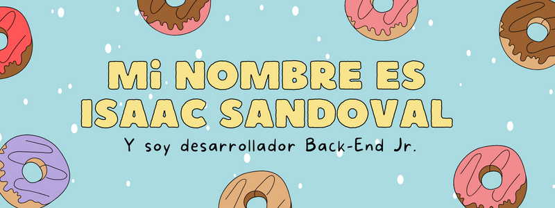

    

|  |  |
| ------------- | ------------- |

### Languages y herramientas conocidas:

 

    
    
      
      
     
    
     
     
     
     
    
    

 

### Languages y frameworks por aprender o en progreso de aprendisaje:

        
    
    
    
    

