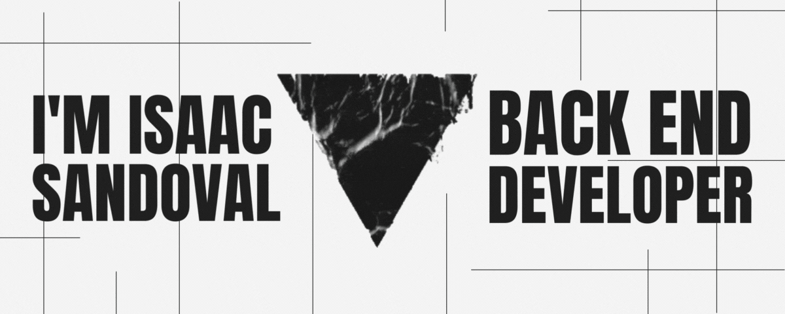

<p align="center">
  
</p>

<a href="https://github.com/IsaacJSandovalC" target="_blank">
  
</a>
<a href="https://www.linkedin.com/in/isaac-sandoval-993243255/" target="_blank">
  
</a>
<a href="https://instagram.com/x.ijsc" target="_blank">
  
</a>
  


## 😄 About me!  
Hi, I'm Isaac Sandoval Jr. Back-End developer. I'm studying at the Universidad Interameriacana de Panamá a degree in Systems, I'm currently certifying as a Python developer and artificial intelligence. I plan to specialize in back end to later become a full stack developer.

<br/>  

## 🧑🏽‍💻 Known tools:  
<table>
    <div>
      <td align="Center">
        <p>Python</p>
        <a href="https://www.python.org/" target="_blank"
          ></a>
      </td>
      <td align="Center">
        <p>Java</p>
        <a href="https://www.java.com/" target="_blank"
          ></a>
      </td>
      <td align="Center">
        <p>C++</p>
        <a href="https://www.cplusplus.com/" target="_blank"
          ></a>
      </td>
      <td align="Center">
        <p>Git</p>
        <a href="https://github.com/" target="_blank"
          ></a>
      </td>
      <td align="Center">
        <p>HTML 5</p>
        <a href="https://en.wikipedia.org/wiki/HTML5" target="_blank"
          ></a>
      </td>
      <td align="Center">
        <p>CSS 3</p>
        <a href="https://es.wikipedia.org/wiki/CSS" target="_blank"
          ></a>
      </td>
      <td align="Center">
        <p>Django</p>
        <a href="https://www.djangoproject.com/" target="_blank"
          ></a>
      </td>
      <td align="Center">
        <p>MySQL</p>
        <a href="https://www.mysql.com/" target="_blank"
          ></a>
      </td>
      <!-- <td align="Center">
        <a href="https://www.apachefriends.org/" target="_blank"
          ></a>
      </td> -->
    </div>
  </table>


<br/>  


## 🖥️ Technologies to be learned or in the process of being learned:  
<table> 
  <div>
      <td align="Center">
        <p>Flask</p>
        <a href="https://flask.palletsprojects.com/" target="_blank"
          ></a>
      </td> 
    <td align="Center">
      <p>PHP</p>
      <a href="https://www.php.net/" target="_blank"
        ></a>
    </td>
    <td align="Center">
        <p>Symfony</p>
      <a href="https://symfony.com/" target="_blank"
        ></a>
    </td>
    <td align="Center">
        <p>Laravel</p>
      <a href="https://laravel.com/" target="_blank"
        ></a>
    </td>
    <td align="Center">
        <p>JavaScript</p>
      <a href="https://www.javascript.com/" target="_blank"
        ></a>
    </td>
    <td align="Center">
        <p>React.js</p>
      <a href="https://reactjs.org/" target="_blank"
        ></a>
    </td>
    <td align="Center">
        <p>Node.js</p>
      <a href="https://nodejs.org/" target="_blank"
        ></a>
    </td>
    <td align="Center">
        <p>Express.js</p>
      <a href="https://expressjs.com/" target="_blank"
        ></a>
    </td>
    </table>
</div>

<br />

<br/>  

## 🔥 Github Stats 
<table>
  <tr>
    <td valign="top" width="50%">
      
    </td>
    <td valign="top" width="43%">
      
    </td>
  </tr>
</table> 

## 📚 General Stats and lenguajes

<!--START_SECTION:waka-->
📊 **This Week I Spent My Time On** 

```text
💬 Programming Languages: 
Python                   15 hrs 57 mins      ███████████████████░░░░░░   79.34% 
HTML                     3 hrs 9 mins        ████░░░░░░░░░░░░░░░░░░░░░   15.72% 
JSON                     52 mins             █░░░░░░░░░░░░░░░░░░░░░░░░   4.32% 
JavaScript               4 mins              ░░░░░░░░░░░░░░░░░░░░░░░░░   0.37% 
CSS                      2 mins              ░░░░░░░░░░░░░░░░░░░░░░░░░   0.18%

🔥 Editors: 
VS Code                  14 hrs 43 mins      ██████████████████░░░░░░░   73.21% 
PyCharm                  5 hrs 23 mins       ██████░░░░░░░░░░░░░░░░░░░   26.79%

💻 Operating System: 
Mac                      19 hrs 51 mins      ████████████████████████░   98.75% 
Windows                  8 mins              ░░░░░░░░░░░░░░░░░░░░░░░░░   0.74% 
Linux                    6 mins              ░░░░░░░░░░░░░░░░░░░░░░░░░   0.51%

```


 Last Updated on 09/12/2022 12:32:26 UTC
<!--END_SECTION:waka-->


